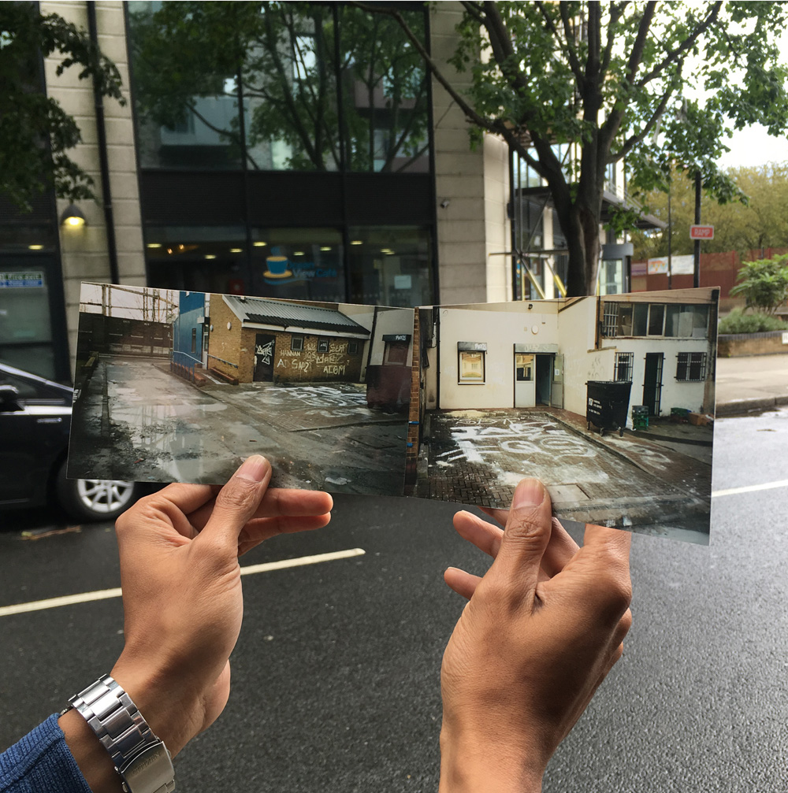
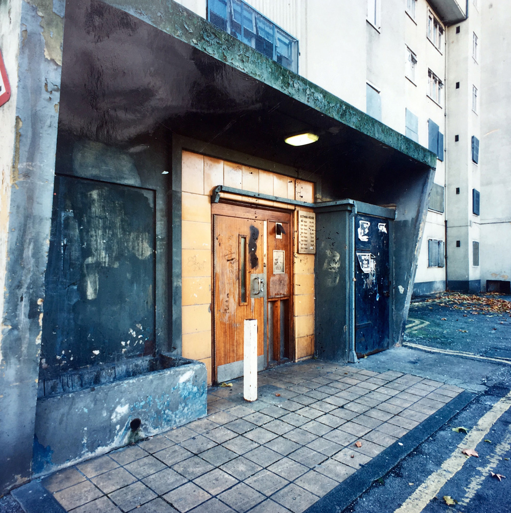

The estate was built in the early 60’s and has 297 homes. Regeneration plans for the High Road West scheme were approved by Haringey Council’s Cabinet in December 2014, this includes the demolition of the Love Lane estate. Haringey Council served an Initial Demolition Notice to residents on the estate in February 2015 and the Council began rehousing secure council tenants and moving in temporary tenants – there are now 180 temporary tenants on the estate. A resident’s ballot is due to take place on the estate.

Key themes discussed in the interviews:
        

<ul>
		<li>Love Lane residents express a lack of clear information about the regeneration of their estate, despite some council tenants being moved out several years back and having temporary tenants moved into these properties.</li>
		<li>Those with temporary tenancies feel especially disregarded and vulnerable to displacement.</li>
		<li>Long term residents on the Love Lane estate expressed a sense of intentional degeneration of the estate.</li>
		<li>There is a feeling that the area is changing for a different more middle-class demographic.</li>
		<li>Long term housing affordability in the Tottenham area is a shared concern.</li>
		<li>There is a common mistrust towards Haringey Council and its leadership; often referenced is the failed Haringey Development Vehicle (HDV) scheme, the threat of displacement to the Latin Village, and the dominance of the Tottenham Hotspurs Stadium on the area.</li></ul>

Here is what some people said...

 

      

        

          

            

              
            

            

              

                <strong>Love lane estate resident</strong> 
                <em>Temporary council tenant</em>
              

            

          

          

            

              

                "[...] We don’t know anything. We, our future is still uncertain because we haven’t gotten any clear message. Unless you get a clear message, you cannot plan for your future, you don’t understand what’s going to happen. So you need a clear message, you need better planning on the part of the Council, so that people do feel a sense of security in the days to come."
              

            

          

        

      

      

        

          

            

              
            

            

              

                <strong>Love lane estate resident</strong> 
                <em>Council tenant</em>
              

            

          

          

            

              

                "So that was another thing, that it [the estate] was being left, sort of thing, and you get that overall feeling of just slow decay."
              

            

          

        

      

      

        

          

            

              
	    

            

              

                <strong>Love lane estate resident</strong> 
                <em>Temporary Council tenant</em>
              

            

          

          

            

              
"I can't afford it [private sector rent]. Yeah, for, to have a, to pay [£]1,800 for two-bedroom flats, it is impossible. And then, they are helping you, the housing benefits covering 65%, and the rest we have to, you know, help ourselves, and no, the prices they are ridiculous! You can't rent it."

            

          

        

      

    

    

      <h5 class="card-title">MOVING_ME project by Platform 7</h5>
      
A collection of photographs and stories contributed by residents of the Ocean estate that best represents how they feel about the structural and social change taking place around them.

      <a href="/images/Moving_Me_Ocean.pdf" class="btn btn-primary">Open the file</a>
    

  

  

    
  
	  
  

    
  

    

